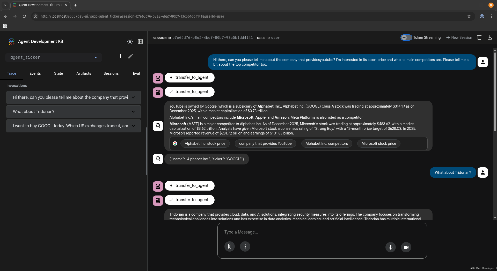
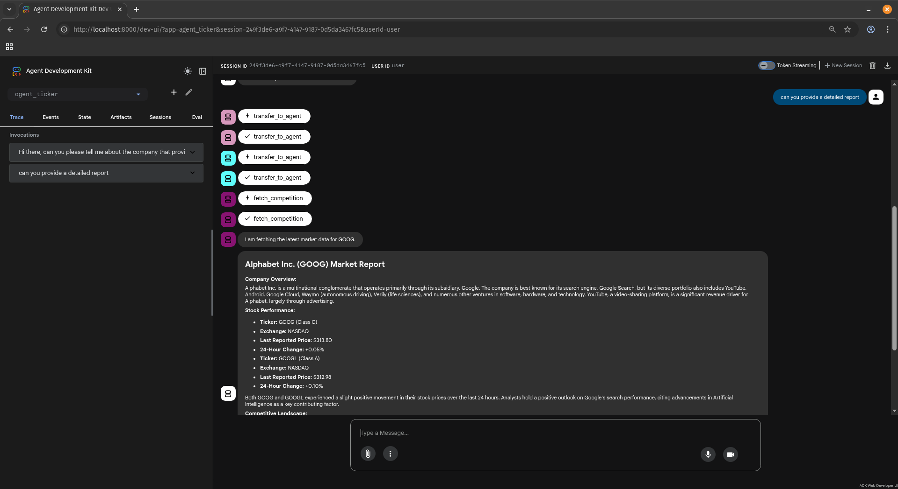
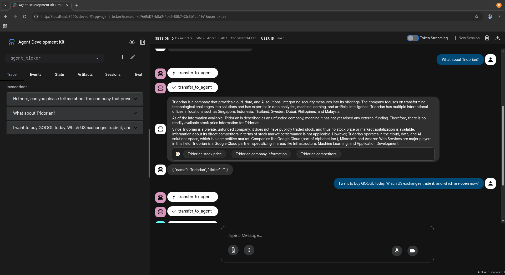
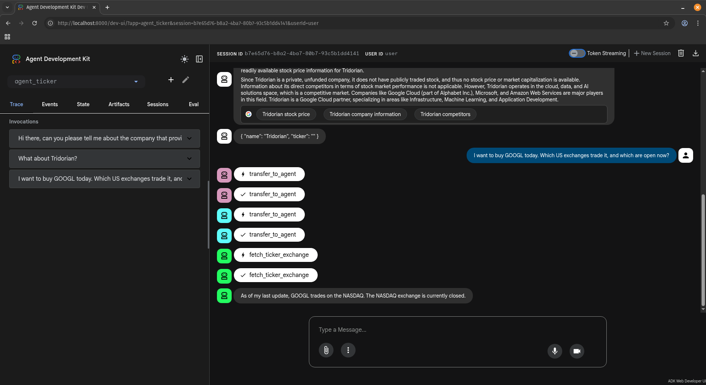
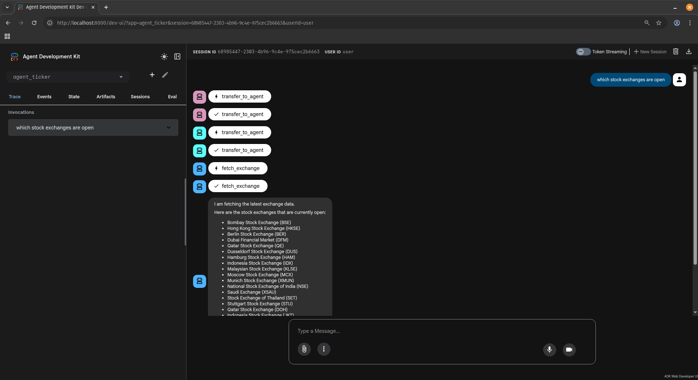
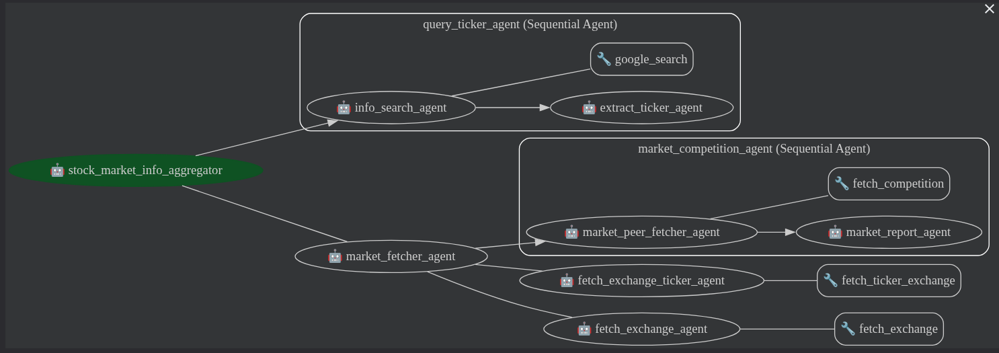

# TRD Ticker

## Setup Instructions

### Linux/Unix

#### 1. Setup python environment

##### Ensure that your python version is 3.11 and above.

We recommend using [pyenv](https://github.com/pyenv/pyenv) to install multiple different python versions.

##### Install [poetry](https://python-poetry.org/).

We recommend using [pipx](https://pipx.pypa.io/latest/installation/) to install poetry. A full set of instructions is shown below:

```bash
python3 -m pip install --user pipx
python3 -m pipx ensurepath
pipx install poetry
```

##### Clone the repository

```bash
git clone git@github.com:awidyaputra/trd_ticker.git
cd trd_tracker
```


##### Install python dependencies using poetry

```bash
poetry install
```


#### 2. Setting up the authkey and environment variables

We'll be using Financial Modeling Prep (FMP) and Google Agent Develoopment Kit (ADK) as external APIs to our program.
The repository, provides `.env.default` as a environment variable file template. Copy the file to a new `.env` file on your local machine.

```bash
cp .env.default .env
```

##### Financial Modeling Prep (FMP)

1. Ensure that you have an account to [Financial Modeling Prep](https://site.financialmodelingprep.com/). Login to your account.
2. Navigate to the [dashboard](https://site.financialmodelingprep.com/developer/docs/dashboard).
3. Copy your authkey to the value of `FMP_API_KEY=` in the `.env` file.

##### Google Agent Development Kit (ADK)

1. Ensure that you have a Google Account. Login to your account.
2. Navigate to the [the AI key page](https://site.financialmodelingprep.com/developer/docs/dashboard).
3. Copy your gemini key to the value of `GOOGLE_API_KEY=` in the `.env` file.


## How to run

#### 1. Ensure that you're in the root directory of `trd_ticker`.
#### 2. Ensure that you are inside the poetry virtual environment

```bash
eval $(poetry env activate)
```

#### 3. Run `adk web` and open the client on a web browser with the default address of `localhost:8000`.
#### 4. Select the `agent_ticker` agent on the top-left of the page if it is not selected by default.

## Test Scenarios

The test scenario was run one after another. The following are screenshots of the three scenarios. Note that displayed are best-case responses.

### Scenario 1



Above is the result of asking `"Hi there, can you please tell me about the company that provides youtube? I'm interested in its stock price and who its main competitors are. Please tell me a bit about the top competitor too."` to the agent. It uses the provided `google_search` tool provided by ADK and is able to provide an answer to the top competitor question.



We provided an additional tool that grabs latest data from FMP and creates a report. However an additional prompt for detail report is required to trigger the agent to run the tool. The result of the report is shown below.


### Scenario 2



The `google_search` tool is most useful when asking about Tridorian. By default, the agent would not be able to provide any information at all about Tridorian. However, using the `google_search` tool, a brief summary of Tridorian and the reason for being unable to extract a ticker is explained.

That said, it's quite often that the summary would not be provided. This is because the prompt or session context assumes that we are only interested in a finance or stock market context.

### Scenario 3



The agent is able to answer the question `I want to buy GOOGL today. Which US exchanges trade it, and which are open now?` correctly. However, sometimes an additional prompt might be required when all three scenarios are run without resetting the session. This is likely because when asking about Tridorian, the `extract_ticker` tool saves an empty ticker. This is then used to fetch data using the FMP API.



An additional tool was created to check all open exchanges.

## Design Choices

### Overall architecture



Above is the overall architecture of the system. It uses the Coordinator/Dispatcher Pattern to delegate tasks based on general query or queries that require detailed or latest data. The `market_fetcher_agent` will also delegate tasks based on the type of information that the user requires. The Sequential Pipeline Pattern is also used in two different ways. The first is to extract structured data after general search. The second is generate a report after deterministically fetching information using an external API.


### Extracting ticker

Extracting ticker was done by creating a Sequential Agent. The first agent used the `google_search` tool to provide Retrieval Augmented Generation (RAG) and grounding to the search. One thing to note is that agents using the `google_search` tool must run by itself. The second agent then used a Pydantic model to extract the `company.name` and `company.ticker` from the first agent output. It will then store the values into the context state.

### Compound Tool concurrent design

The Compound Tool was built using a Sequential Agent. The first agent was a LLMAgent that only had a single custom tool to fetch data from FMP. The second agent then made a report based on the saved results of the first agent.

A simple dependency graph for the first agent is as follows:

1. fetch_quote
2. fetch_company
3. fetch_peers -> sort_peers and select top 3 based on price -> fetch_profile

The coroutines 1, 2, 3 were all done concurrently. The `fetch_profile` coroutine was also done concurrently. This was done using `asyncio.wait_for` and `asyncio.gather` functions. Additionally, partial functions were also used to `fetch_profile`. This was because the the same API and function was called with only differences in the ticker.


## Assumptions and Trade-offs

### Assumptions

The biggest assumption is that the ideal flow of conversation starts with general company queries then asking about details. You can only change the discussed company and ticker when still asking general questions about companies.

### Trade-offs

For speed of development, two noticeable mistakes were made:

1. The root agent prompt needed to be much more descriptive. 
2. More keywords needed to be used.

The results of these mistakes made it difficult for the agent to delegate back to the general query agent once detailed market and exchange prompts are asked.

### Future work

The first thing that I would like to explore is running the program without `adk web`. Ideally, developers can run `adk web` and a `main.py` program as well. The ADK API provides the ability to create Session and Context objects. This allows us to save information across different agents and help build a more deterministic flow. It also allows us to set an initial value of all possible variables that would be needed to be saved. Lastly, it would make the async flow of the program much clearer.

## AI Tool Usage Log

No AI tools were used. The following were the main resources for each concept required by the assignment.

### Asyncio

* Python's asyncio docs [link](https://docs.python.org/3/howto/a-conceptual-overview-of-asyncio.html#a-conceptual-overview-of-asyncio)
* EdgeDB's asyncio video playlist [link](https://www.youtube.com/watch?v=Xbl7XjFYsN4&list=PLhNSoGM2ik6SIkVGXWBwerucXjgP1rHmB)
* aiohttp docs [link](https://docs.aiohttp.org/en/stable/index.html)

### ADK

* ADK docs [link](https://google.github.io/adk-docs/)
* ADK agent samples, specifically the travel-concierge example [link](https://github.com/google/adk-samples/blob/main/python/agents/README.md)

### External API

* Financial Modeling Prep docs [link](https://site.financialmodelingprep.com/developer/docs)

